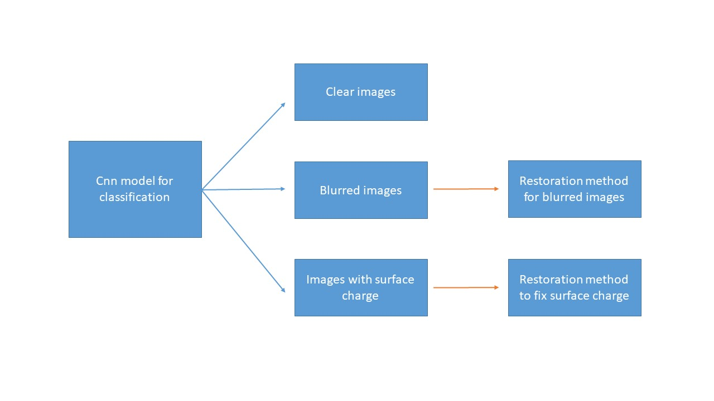

# Project REIP

 _"REIP: Resolution Enhancement Image Project"_
 A package to classify damaged SEM images and do image restoration.
 
## Project Objective

The goal of this project is to develop a software to help new comer students to get familiar with SEM. A common question for new comers is how to judge the quality of images. In this case, the software is developed to distinguish whether the image is clear, blurred or suffers from surface charge. Moreover, with the classification results, students could decide whether spending time to restore the image or not. Image restoration packages, such as pillow and open.cv, is included to optimize the picture in this software. Depending on the quality of the image, the restoration time varies. Receiving the final image, students are able to get the ideal images for their research.

## Guide of this directory
1. Most of the functions we used in this project are in the REIP folder, including the image restoration functions, the cnn model, the cnn prediction function and the functions used to conduct streamlit.
2. The doc folder contains the descriptions of the image restoration packages and the user cases. Moreover, the **project ppt** is also in this folder.
3. The examples folder includes the notebooks of constructing the cnn model and the image restoration methods.

## Requirements:
Package REIP has following main dependencies:
1. Python = 3.7
2. OpenCV
3. Tensorflow = 2.7

## Installation:
1. In your terminal, run <code>git clone https://github.com/william860925/REIP.git</code> and cd into it
2. Install and activate REIP environment by typing <code>conda env create -f REIP.yml</code> and <code>conda activate REIP.yml</code>
3. Change the directory to REIP root directory, by running <code>cd REIP</code> 
4. Make sure you've download the streamlit package, if not type <code>pip install steamlit</code>
5. In your terminal, run <code>streamlit run streamlit_app.py</code>

## Usage:

REIP uses Convolutional Neural Network (CNN) for train the prediction model. Later on, we used packages of OpenCV and Pillow to restore the damaged or imperfect images. The flow of information is shown in image below:

## Use Cases:
* Upload the image you want to check the quality of

* Classigy microscopic images into groups of clear, blur, surface charged

* Repair the imperfect images by their groups:
1. Repair the blurred images by an automated function
2. Repair the images with surface charge by a manual method which requires you to frame the location of surface charge

In streamlit:
1. Use "Browse files" to upload the image you want to use, and the classification result will automatically show up
2. Due to the classification result, the corresponding restoration method will show up
3. For the surface charge restoration method, you first frame the surface charge area, then use the bar on the left hand side to adjust the brightness.After the surface charge restoration, you can also proceed the blurred image restoration
4. For the blurred image restoration, there are 6 kinds of methods you can choose, which are img_processing', 'enhance_details', 'edsr', 'espcn', 'fsrcnn' and 'lapscn' (see <a href=https://github.com/william860925/REIP/blob/main/doc/method_description.ipynb>method description</a>) . You can choose each of them to repair the blurred image. SeeMoreover, you can also do another method after your first one is completed.

## Acknowledgment:
We would like to acknowledge the SEM images support from National Tsing Hua university (NTHU) Energy & Optoelectronic Materials Lab
